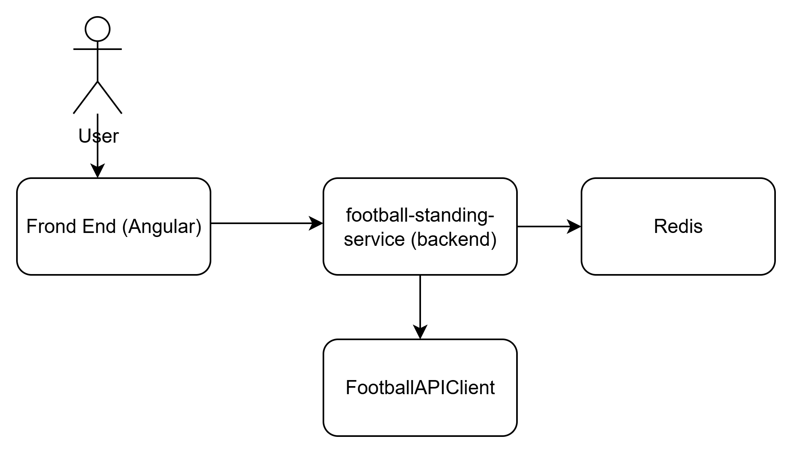
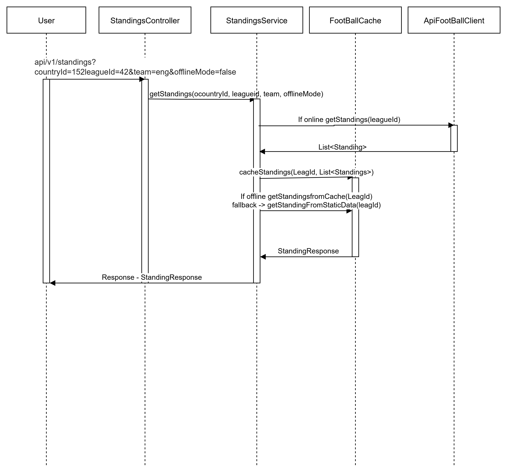

# ⚽ Football Standings Microservice

A full-stack microservice to retrieve football team standings by country, league, and team name.

### **Features**

1. [x] Accepts country, league, team and optional offlineMode as input parameters.
2. [x] Returns a standings for the respective request
3. [x] Supports offline fallback using cached/static standing data.
4. [x] Designed for extensibility, new alert conditions can be added with minimal code and without requiring major
   redeployments.

### **System Architecture Overview**

The application follows a client-server architecture with:

* **Frontend:** Angular 16

* **Backend:** Java 21 and Spring Boot (REST API)

* **Data Source:** FootBallAPIClient API (External)

* **API Documentation:** Swagger/OpenAPI

* **Security:** Spring basic security for API access

* **CI/CD:** Jenkins

* **Cache:** Redis

### **Sequence Diagram**

### Design Patterns Used

| Pattern | Where Applied |
|---|---|
| **Singleton Pattern** | Spring components are singletons by default |
| **Strategy** | `FootballClient` interface → `ApiFootballClient` |
| **Facade** | `StandingsService` hides API complexity from controller |
| **Chain of Responsibility** | Spring Security filter chain |
| **Builder** | All model/DTO creation via Lombok `@Builder` |
| **Circuit Breaker Pattern** | Implemented using Resilience4j to handle API failures gracefully |
| **Bulkhead Pattern** | Used to limit the concurrent calls to client API |

### SOLID Principles
- **S** — Each class has one responsibility (service, client, controller, config are separate)
- **O** — New API providers can be added by implementing `FootballClient` without changing `StandingsService`
- **L** —  NA
- **I** — `FootballClient` interface is minimal (3 methods)
- **D** — `StandingsService` depends on the `FootballClient` abstraction, not concretions

### 12-Factor App Compliance
- **Config** — API key via `FOOTBALL_API_KEY` env var
- **Port binding** — Configurable via `server.port`
- **Logs** — stdout/stderr structured logging
- **Backing services** — External API treated as attached resource
- **Disposability** — Fast startup, graceful shutdown
- **Dev/prod parity** — Same Docker image across environments 

